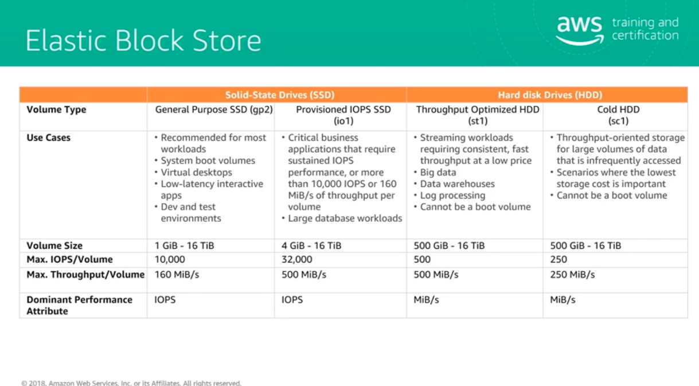

# FIrst Day of SAA studying

## Studying resources

[Exam Readiness: AWS Certified Solutions Architect - Associate](https://explore.skillbuilder.aws/learn/course/external/view/elearning/125/exam-readiness-aws-certified-solutions-architect-associate-digital?saa=sec&sec=prep)

### Chapter 1 introduction
#### most important services

1. IAM : Amazon Identity and access Management -> permissions/security 
2. VPC : Amazon Virtual Private Cloud -> design
3. EC2(+EBS) : Amazon Elastic Compute Cloud -> architecture, EBS(Amazon Elastic Block Storage) compare with ECS(Amazon Elastic Container Service) and Lambada
4. ELB(+Auto Scaling) : Elastic Load Balancing
5. RDS(Aurora) : Amazon Relational Database Services -> difference between EC2 database
6. S3(+S3 Glacier) : Amazon Simple Storage Services

#### Something important

- DNS services Route 53
- monitory Cloud Watch
- AWS resource auto build CloudFormation
- management service
  - CloudFront
  - ElasticCache
  - SQS
  - SNS

### Chapter 2
#### Region and availability zone(AZ)

AZs are separated and can reduce the influence from interference

multiple regions and AZ can design for more usable architecture.

#### VPC(Amazon Virtual Private Cloud)

- IP Address CIDR Block
  - [CIDR](https://en.wikipedia.org/wiki/Classless_Inter-Domain_Routing)
  - サブネットに設定するCIDR Block のsizeはVPCと同様に16bit
- Subnet　
  - multi AZ同じ役割を持ったサブネットを複数のAZにそれぞれ作ることです。
  - Public Subnet
  - Private Subnet 
- Route table
- Security group and network ACL(Access Control Lists)
  - inbound
  - outbound
- Gateway
  - IGW(Internet Gateway)
    - EC2 should have a public IP when using Internet
  - VGW(Virtual Gateway)
    - connect between (VPN or Direct Connect) and VPC
  - NAT gateway
- VPC endpoint
  - connect to S3 , DynamoDB or AWS PrivateLink
  - great in security(?)
- Peering connect
  - ***private Connect*** for between two VPC 
- VPC Flow Logs
  - records every ENI(Elastic Network Interface)
- Direct Connect and Direct Connect Gateway
  - Direct Connect Gateway for multi AWS account or VPC
  - AWS Transit Gateway multi VPC and unpremised network 
### First Class Design resilient Architecture

#### Elastic Block Store

#### Elastic File System